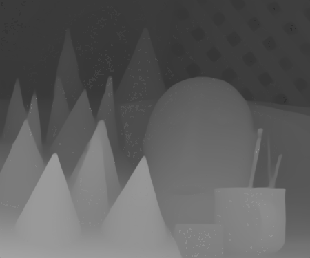

SGM-Census with mono-depth initial guess
========================================
In this assignment, we will have to develop the code of a basic implementation of the Semi-Global
Block Matching (SGM) stereo matching algorithm. Furthermore, in addition to the pair of input
stereo images an initial guess of the disparity map is provided. This initial guess is generally very
accurate but defined up to a scalar factor. After computing the disparity map with SGM, we can
compute the scalar factor present in the initial guess and use the scaled initial guess disparity map
to refine/complete the disparity map computed with SGM.

  
   
  

---
## Instructions

**Building (Out-of-Tree)**

    mkdir build
    cd build/
    cmake ..
    make
    
**Usage (from build/ directory)**

    ./sgm <right image> <left image> <monocular_right> <gt disparity map> <output image file> <disparity range> 

**Examples**

    ./sgm ../Examples/Aloe/right.png ../Examples/Aloe/left.png ../Examples/Aloe/right_mono.png ../Examples/Aloe/rightGT.png output_disparityA.png 85

    ./sgm ../Examples/Cones/right.png ../Examples/Cones/left.png ../Examples/Cones/right_mono.png ../Examples/Cones/rightGT.png output_disparityC.png 85

    ./sgm ../Examples/Plastic/right.png ../Examples/Plastic/left.png ../Examples/Plastic/right_mono.png ../Examples/Plastic/rightGT.png output_disparityP.png 85

    ./sgm ../Examples/Rocks1/right.png ../Examples/Rocks1/left.png ../Examples/Rocks1/right_mono.png ../Examples/Rocks1/rightGT.png output_disparityR.png 85

---

